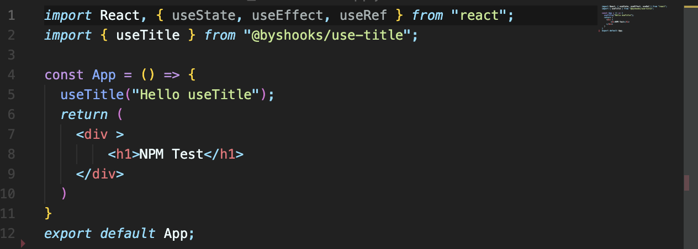
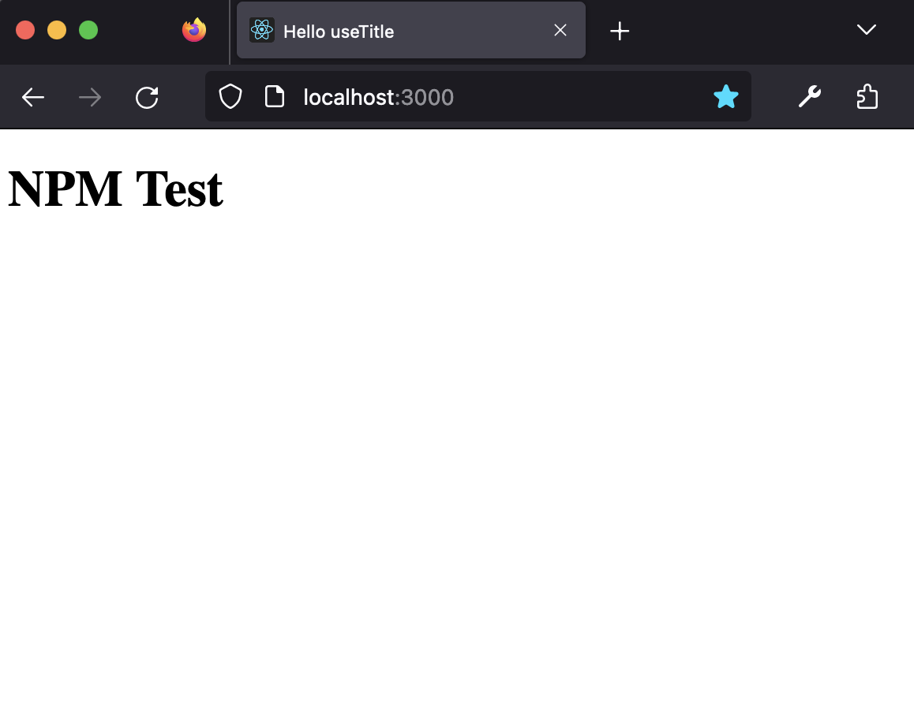

# Coding_React
> Studying React.js  
> Link : [Notion](https://www.notion.so/React-js-1afe79ad19e84f47ad3e27ae044f57bf?pvs=4)
## 1. Nomad Coders_React for Beginner ([Link](https://nomadcoders.co/))
> Introduction : React Basic Lectures  
> URL : [React_for_Beginners](https://nomadcoders.co/react-for-beginners/)  
> Stack : React.js, Node.js, JavaScript  
> Result : Create Simple React App and Deploy in github-pages  
## 2. Nomad Coders_React hooks Introduction  
> Introduction : Study React Hooks  
> URL : [React_hooks](https://nomadcoders.co/react-hooks-introduction/)  
> Stack : React.js, Node.js, JavaScript  
> Result : Create & Publish NPM Packages
> 
 
Result View

> * NPM Organization  
>   
> * import & use Custom Hooks  
>   
> * Result View in Web Browser  
>   
> 

## 3. Nomad Coders_React Clone Coding
> Introduction : Clone Coding Twitter App  
> URL : [React_Clone_Coding](https://nomadcoders.co/nwitter/)  
> Stack : React.js, Firebase, Node.js, Javascript
